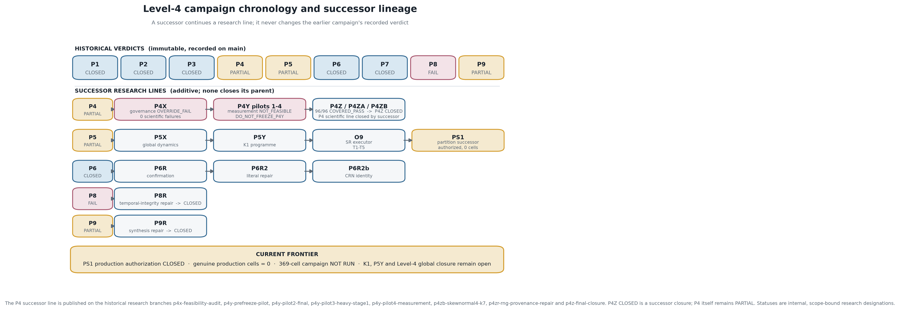
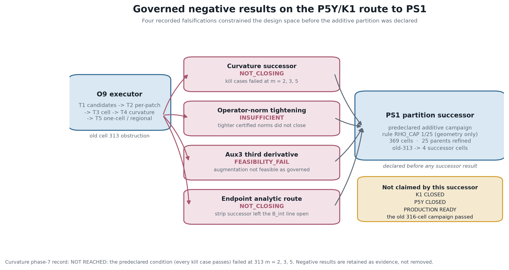
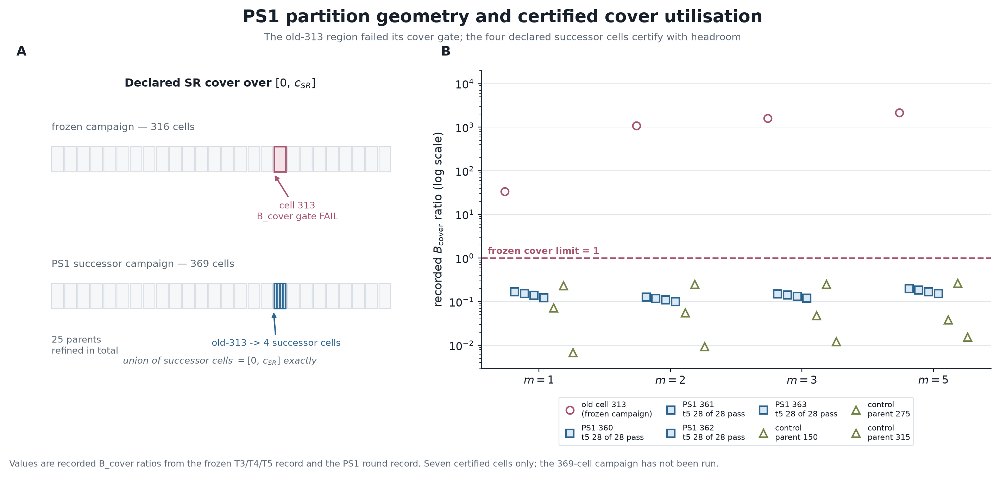
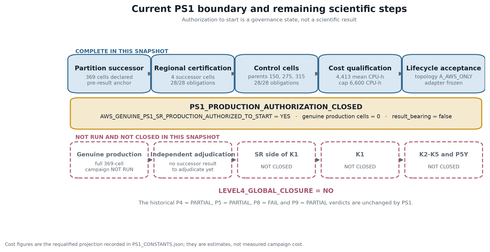
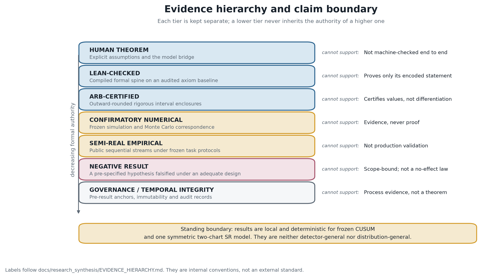

# ReBaseGuard

**ReBaseGuard studies how repeated monitoring changes when observations selected
by an alarm stopping time are reused to update the next reference state.**

## Plain-language abstract

Drift monitoring is often repeated: a system raises an alarm, updates its
reference, and starts monitoring again. If that update reuses observations that
helped trigger the alarm, the reference data were selected through a
data-dependent stopping event rather than sampled afresh. ReBaseGuard studies
the recursive feedback created by this reuse. It develops mathematical
descriptions of the resulting reference dynamics, with rigorous local
instability results for frozen CUSUM and symmetric two-chart
Shiryaev-Roberts settings. It also evaluates a stability-aware reuse policy on
simulated and semi-real streams. The policy receives scoped support in the
tested regimes, while a pre-specified operational-transition hypothesis
produces a negative result. The project keeps theorem, formal proof, certified
numerics, empirical evidence, and limitations distinct.

## Why this problem exists

The cycle is **monitor -> alarm at a data-dependent stopping time -> reuse
alarm-participating observations -> update the next reference -> monitor
again**. Because the alarm selected the reused observations, they need not
behave like fresh reference data; the resulting update then changes later
monitoring cycles.


## Results at a glance

> **Strongest rigorous core.** For the frozen two-sided Gaussian CUSUM with
> \(m=1,\rho=1,k=1/2,h=5\), a human theorem connects the reference-map
> derivative to the stopped gain; Lean kernel-checks the differentiation and
> moment spine; and an independent outward-rounded Arb certificate proves
> \(\Gamma_{\mathrm{CUSUM}}>2\). Together—not Lean or Arb alone—these establish
> that zero is locally repelling for the deterministic conditional-mean map.

| Result | Evidence type | Current status |
|---|---|---|
| CUSUM stopped-selection derivative | Human bridge + Lean-checked spine | Proved for the frozen model |
| \(\Gamma_{\mathrm{CUSUM}}>2\) | Arb interval certificate | Certified |
| Symmetric two-chart SR local instability | Human/conditional Lean spine + separate Arb certificate | `SR-GAMMA-CERTIFIED` |
| Deterministic period-two skeleton | Human theorem + rigorous numerical certificate | Certified within the stated interval |
| Finite-window \(m>1\) derivative | Human theorem + conditional Lean spine | Closed for the Track-1B convention |
| Stability-aware P3 policy | Frozen numerical + semi-real evidence | Scoped empirical support |
| Operational crossing hypothesis | Frozen operational evaluation | Negative result under the tested protocol |

## Core mathematical result

For reuse fraction \(\rho\), reference error \(e\), and stopped gain
\(\Gamma\), the frozen \(m=1\) derivative is

\[
F'_\rho(0)=\rho(1-\Gamma).
\]

Arb certifies
\(\Gamma_{\mathrm{CUSUM}}\in[3.9243482,27.8493821]\). The later, separate
symmetric two-chart SR upgrade certifies
\(\Gamma_{\mathrm{SR}}\in[5.800391799508442,28.781285803081492]\), whose lower
endpoint exceeds two by \(3.800391799508442\). These are local deterministic
results, not global or operational instability theorems for noisy chains.

## Historical campaign status (P1-P9)

These verdicts are immutable. No successor campaign anywhere in this repository
rewrites, recolors, or retroactively closes them.

| Priority | Status | Current conclusion |
|---|---|---|
| P1 | `CLOSED` | The frozen \(m>1\) CUSUM derivative theorem is closed within its stated convention. |
| P2 | `CLOSED` | The frozen symmetric two-chart SR derivative/stability result is closed, with its supporting Lean and Arb evidence. |
| P3 | `CLOSED` | The reuse-fraction local stability map is closed; its conclusions are local deterministic results. |
| P4 | `PARTIAL` | The general location-family derivative theorem and supporting proof, numerical, Lean, and Arb evidence survived independent review. Three frozen preregistered numerical closure gates remain literally false; none was weakened or rewritten. Novelty remains `NOVELTY-NOT-ADJUDICATED`. |
| P5 | `PARTIAL` | The raw-mean identity and the fixed-policy invariant-law/ergodicity theorem survive independent adjudication. Global deterministic attraction, operational-invisibility, and universal finite-grid claims were narrowed; several literal closure gates fail. Novelty remains `NOVELTY-NOT-ADJUDICATED`. |
| P6 | `CLOSED` | The safe-rebaselining campaign and its literal closure repairs are complete at the repository's authoritative status; its scope and negative results remain as adjudicated. |
| P7 | `CLOSED` | Independent adjudication confirms material monitoring degradation under recursive re-baselining, while \(\rho_c\) is a local mathematical boundary, not an operational safety boundary under the frozen criterion. |
| P8 | `FAIL` | Broad tested local repulsion and operational degradation reproduce, but the cross-family window law and its sub-gates are rejected, G7 fails literally, and the temporal-integrity gate fails. The evidence is scope-bound and novelty is not independently adjudicated. |
| P9 | `PARTIAL` | The retrospective synthesis, P8 quarantine, exact \(\rho=0\) invariant law, and stationary mixture identity survive. P9-T2's strict ARL deficit is conditional as submitted; the claim ledger inflates its monotonicity premise, the SR replay has a first-step recurrence mismatch, and A5/A6 lack supplied generators. |
| P9R | `CLOSED` | Independent adjudication closes the separate P9 repair lineage: the pre-result anchor is valid, original P9 remains immutable and `PARTIAL`, the \(\rho=0\) theorem is exact in frozen scope, the strict deficit remains conditional on unproved `ASM-DOM`, the SR recurrence is corrected, and A5/A6 are reproducible. This does not close Level 4 globally. |

## Successor research lines

A successor is a **new, additively declared campaign** that continues a research
line behind a pre-result temporal anchor. "Superseded" means later research
continues the line. It never means an earlier campaign disappeared, and it never
converts an earlier `PARTIAL` or `FAIL` into a pass.



| Line | Successors | Recorded outcome |
|---|---|---|
| P4 | P4X, P4Y pilots 1-4, P4Z/P4ZA/P4ZB | P4 remains `PARTIAL`; `P4Z = CLOSED` and the P4 scientific line is `CLOSED_BY_LATER_SUCCESSOR`; see below |
| P5 | P5X -> P5Y -> O9 -> PS1 | P5 remains `PARTIAL`; PS1 is the current frontier |
| P6 | P6R -> P6R2 -> P6R2b | Literal-closure repairs within P6's adjudicated scope |
| P8 | P8R | Temporal-integrity repair lineage, `CLOSED`; P8 remains `FAIL` |
| P9 | P9R | Synthesis repair lineage, `CLOSED`; P9 remains `PARTIAL` |

### The P4 successor line

The P4 line is published as historical research branches rather than as a
`main` namespace. It is retained in full because two of its three stages are
informative negative results:

- **P4X** ([`p4x-feasibility-audit`](https://github.com/flaggielover/ReBaseGuard/tree/p4x-feasibility-audit))
  reached 88/96 binding PASS with **0 scientific failures**, but its own
  successor verdict was overridden to `FAIL` on governance and sampling
  integrity: stage-2 top-up sharding used `ceil(B/K)` per shard, executing four
  unauthorised blocks and 1,000,000 unauthorised paths at `B=8801, K=5`, and
  precision attainment held only in expectation. The science did not fail; the
  campaign's execution governance did.
- **P4Y** (branches
  [`p4y-prefreeze-pilot`](https://github.com/flaggielover/ReBaseGuard/tree/p4y-prefreeze-pilot),
  [`p4y-pilot2-final`](https://github.com/flaggielover/ReBaseGuard/tree/p4y-pilot2-final),
  [`p4y-pilot3-heavy-stage1`](https://github.com/flaggielover/ReBaseGuard/tree/p4y-pilot3-heavy-stage1),
  [`p4y-pilot4-measurement`](https://github.com/flaggielover/ReBaseGuard/tree/p4y-pilot4-measurement))
  is a measurement-architecture feasibility line. Pilots 1-3 each returned
  `NEEDS_ONE_MORE_PRE_FREEZE_PILOT`; Pilot-4 concluded
  `P4Y_MEASUREMENT_FEASIBILITY = NOT_FEASIBLE` and `DO_NOT_FREEZE_P4Y`. No P4Y
  Checkpoint A was frozen and no P4Y production campaign was run.
- **P4Z / P4ZA / P4ZB**
  ([`p4zb-skewnormal4-k7`](https://github.com/flaggielover/ReBaseGuard/tree/p4zb-skewnormal4-k7))
  is a later numerical-correspondence line, run in three stages against the
  unchanged frozen gate. Each stage recorded its own self-verdict:
  **P4Z** `P4Z_NUMERICAL_PASS_AWAITING_FORMAL_OR_GOVERNANCE` (44/96 cells
  adjudicated, 52 `INCONCLUSIVE`); **P4ZA** `P4ZA_INCONCLUSIVE` (92/96, 4 cells
  still open, and the frozen K7 limit explicitly *not* widened to admit them);
  **P4ZB** `P4ZB_CLOSED` (96/96 `COVERED_PASS`, 0 `COVERED_FAIL`, 0
  `INCONCLUSIVE`, exactly one authoritative source per cell).

  `P4ZB_CLOSED` above is the **campaign's own self-recorded verdict**.
  Independent integrated adjudication of the whole line, recorded in
  [`p4z_final_closure`](https://github.com/flaggielover/ReBaseGuard/tree/p4z-final-closure),
  now reads:

  ```text
  P4                    PARTIAL                     historical, immutable
  P4Z                   CLOSED                      successor closure
  P4_SCIENTIFIC_LINE    CLOSED_BY_LATER_SUCCESSOR
  ```

  All three of P4's originally failed gates are discharged by admissible later
  evidence: `all_theorem_supported_cells_pass` by the 96/96 successor result,
  and `all_outside_assumption_cells_demonstrate_failure` and
  `gaussian_consistency_with_closed_core` by P4X obligations C4 and C5 admitted
  under an obligation-local Rule C. **P4X is not rehabilitated as a campaign**;
  Rule C is applied per obligation and nowhere else.

  Two defects stay on the record rather than being erased. The K7 precondition
  was successor-added — it is absent from the frozen P4 protocol — and its
  statistic was redesigned twice, each version frozen before its own run with no
  frozen threshold ever moved. A calibration/production RNG address overlap
  inside P4Z is disclosed in
  [`p4zr_rng_provenance_repair`](https://github.com/flaggielover/ReBaseGuard/tree/p4zr-rng-provenance-repair);
  it is admissible because no disposition-bearing final cell relies on
  overlapped evidence. Both are non-blocking for the same reason: with the
  successor-added `T_B` term removed entirely, all 96 cells still clear the
  frozen gate at worst `|z|` 1.7877 against 4.0 and worst relative discrepancy
  0.0095 against 0.03.

None of this closes P4. The historical `P4 = PARTIAL` verdict on `main` stands,
and no successor may replace it retroactively. What is closed is the **P4Z
successor line** and, through it, the **P4 scientific line** — three distinct
statements that the closure packet keeps deliberately apart.

## Governed negative results

Four routes on the P5Y/K1 line were pursued, recorded, and falsified. They are
retained as evidence because they are what constrained the design space and
motivated the additive PS1 partition. They are governed scientific outcomes, not
accidental engineering failures.



| Route | Classification | What it established |
|---|---|---|
| [Curvature successor](level4/closure_proofs/p5y_k1_sr_o9_curvature_successor/RESULT.md) | `CURVATURE_SUCCESSOR_NUMERICALLY_NOT_CLOSING` | The predeclared kill condition failed at cell 313 for \(m=2,3,5\). |
| [Operator-norm tightening](level4/closure_proofs/p5y_k1_sr_o9_opnorm_successor/RESULT.md) | `OPERATOR_NORM_TIGHTENING_INSUFFICIENT` | Tighter certified norms of the same operator did not close the cell. |
| [Aux3 third derivative](level4/closure_proofs/p5y_k1_sr_o9_aux3_successor/RESULT.md) | `AUX3_SR_FEASIBILITY_FAIL` | The third-derivative augmentation was not feasible under its governance. |
| [Endpoint route](level4/closure_proofs/p5y_k1_sr_o9_endpoint_strip_successor/README.md) | endpoint `NOT_CLOSING`; strip successor micropilot | The analytic endpoint bound missed its gate; the later strip contraction passed the endpoint gate but left the frozen `B_int` line open. |

The old 316-cell SR campaign and its cell-313 failure remain immutable
historical evidence. PS1 does not claim them.

## Current frontier: the PS1 successor

PS1 is a **new additive K1 SR successor campaign**, declared behind a pre-result
temporal anchor. It defines a 369-cell SR universe over the same domain, same
theorem target, and same thresholds; it replaces only the old-313 region with
four deterministic successor cells, chosen by a geometry-only rule fixed before
any successor result existed.



The [PS1 partition result](level4/closure_proofs/p5y_k1_sr_o9_partition_successor/RESULT.md)
records **28/28** obligations for each of the four successor cells and for each
of the three certified control cells. The
[cost qualification and production authorization](level4/closure_proofs/p5y_k1_ps1_production_qualification/RESULT.md)
records a requalified projection of about **4,413-4,642 CPU-h** against a frozen
**6,600 CPU-h** cap, topology `A_AWS_ONLY`, with Vultr `NOT_QUALIFIED_FOR_PS1`.



The current classification is **`PS1_PRODUCTION_AUTHORIZATION_CLOSED`** and
**`AWS_GENUINE_PS1_SR_PRODUCTION_AUTHORIZED_TO_START = YES`**. In this published
snapshot, however:

- genuine PS1 production cells = **0**; production has **not started**;
- the full 369-cell genuine production campaign is **NOT RUN**;
- the SR side of K1 is **NOT CLOSED**, K1 is **NOT CLOSED**, P5Y is **NOT CLOSED**;
- `LEVEL4_GLOBAL_CLOSURE = NO`.

Authorization to start is a governance state, not a scientific result. The
[production namespace](level4/closure_proofs/p5y_k1_ps1_production/README.md)
carries an empty result ledger at freeze, and the recorded start command is
intentionally not run. See the
[PS1 status note](docs/research_synthesis/PS1_CURRENT_STATUS.md).

## Evidence hierarchy and claim boundary



| Evidence layer | What it checks | Status | Entry point |
|---|---|---|---|
| Human mathematics | Model bridge, assumptions, and theorem interpretation | Proved within stated scope | [Theorem map](closure/02_THEOREM_MAP.md) |
| Lean | Stopped-likelihood derivative and moment proof spine | Kernel-checked | [Lean audit guide](rebaseguard-lean/README.md) |
| Arb | Outward-rounded gain enclosures | Certified | [CUSUM certificate](closure/04_ARB_CERTIFICATE.md) |
| Numerical correspondence | Frozen simulations and consistency checks | Confirmatory, not proof | [Evidence hierarchy](docs/research_synthesis/EVIDENCE_HIERARCHY.md) |
| Governance / temporal integrity | Pre-result anchors, immutability, and audit records | Process evidence | [PS1 partition result](level4/closure_proofs/p5y_k1_sr_o9_partition_successor/RESULT.md) |

Lean does not certify either numerical interval; Arb does not prove
differentiation under the expectation. The human theorem supplies the bridge.

## Quick reproduction

```bash
(cd rebaseguard-lean && lake build)
```

```bash
(cd rebaseguard-proof && .venv/bin/python -m rebaseguard_certify.audit proofs/certificate.json)
```

The first command checks the primary Lean library. The second replays the CUSUM
certificate. For frozen release snapshots, use the separate
[`terminal closure snapshot`](docs/releases/LEVEL4_RELEASE_NOTES.md) and
[`SR-GAMMA-CERTIFIED`](docs/releases/SR_GAMMA_CERTIFIED_RELEASE_NOTES.md)
instructions. Current presentation checks are:

```bash
python3 scripts/verify_academic_presentation.py --no-diff-check
```

```bash
python3 docs/research_synthesis/verify_synthesis.py --no-diff-check
```

## Repository map

| Reader question | Entry point |
|---|---|
| What exactly does Lean verify? | [Lean audit guide](rebaseguard-lean/README.md) |
| What is the complete scientific narrative? | [Research synthesis](docs/research_synthesis/README.md) |
| Where are theorem dependencies and evidence boundaries? | [Theorem architecture](docs/research_synthesis/MAIN_THEOREM_ARCHITECTURE.md) and [evidence hierarchy](docs/research_synthesis/EVIDENCE_HIERARCHY.md) |
| Where is the short academic overview? | [Research Brief](docs/research_brief/ReBaseGuard_Research_Brief.pdf) |
| Where are frozen artifacts by topic? | [Reviewer-first repository map](docs/research_synthesis/REPOSITORY_MAP.md) |
| What wording and limitations are authoritative? | [Claim catalog](docs/research_synthesis/CLAIM_CATALOG.md) and [limitations register](docs/research_synthesis/LIMITATIONS_AND_OPEN_ITEMS.md) |
| What is the current successor state? | [PS1 status note](docs/research_synthesis/PS1_CURRENT_STATUS.md) |
| How were the figures derived? | [Figure provenance](figures/final/README.md) |

## Limitations and negative results

- Historical Stage-D D2.3 and Track 1A remain failed. The later Track 1B
  theorem is a separate result under its own random-window convention.
- L4R-13 non-Gaussian robustness remains `PARTIAL` and nonmandatory.
- Results concern frozen CUSUM and one symmetric two-chart SR model; they are
  neither detector-general nor distribution-general.
- Deterministic local multipliers do not establish stochastic invariant laws
  or an operational phase transition. Under the frozen crossing study, **0/4**
  metrics peaked at the crossing and **4/4** were monotone in \(\log m\).
- Policy and semi-real evidence are regime-scoped, not production validation;
  the novelty position is scoped to the documented search.
- PS1 evidence covers seven certified cells. It is not evidence about the
  remaining 362 cells of the declared universe.

## Priority-7 operational consequence

P7's independent adjudication finds that recursive re-baselining materially
degrades monitoring performance. Nominal single-cycle ARL is about **465**;
fresh-reference recursive ARL is roughly **80–162**, and full-reuse ARL roughly
**48–80**, with substantial false-alarm inflation. Detection delay develops a
severe heavy tail. One-cycle calibration can look normal while cycle 2 collapses
to about **5.6–9.4** in mean run length.

The P3 critical reuse fraction \(\rho_c\) is a local mathematical boundary. Under
P7's frozen operational criterion it is **not** an operational safety boundary.
This is a monitoring consequence, not a global nonlinear-dynamics theorem.

### P7 theory-status boundaries

| Statement | Status |
|---|---|
| P7-A | Exact finite-cycle conditional theorem. |
| P7-B | Conditional-exact stationary identity. |
| P7-C | Conditional proposition with an empirically supported but unproved global sign condition. |
| P7-D | Monte Carlo plug-in diagnostic; not certified. |

P7 itself left stationary-law existence, uniqueness, ergodicity, and finite
fourth moment as simulation evidence. P5 now proves those properties for the
same frozen Gaussian constant-policy convention-A chain, with the explicit
cross-reference and limitations recorded in P5's independent adjudication. The
P7 artifacts remain unchanged. The repository distinguishes proved theorems,
conditional theorems, rigorous certificates, numerical evidence, exploratory
observations, and novelty status.

## Future research implications

- **P4:** retain the theorem and its surviving evidence; treat P4X as a
  governance failure with no scientific failure, P4Y as a negative feasibility
  result, and the P4Z/P4ZA/P4ZB line as `CLOSED`, having discharged all three of
  P4's originally failed gates. The P4 scientific line is
  `CLOSED_BY_LATER_SUCCESSOR`; P4's own historical verdict remains `PARTIAL`.
- **P5:** retain the exact raw-mean and fixed-policy ergodicity results; treat
  attraction, global cycle uniqueness, bimodality onset, and the dispersion
  optimum at their adjudicated conditional or numerical tiers.
- **P6:** preserve its adjudicated safe-rebaselining scope and literal repairs;
  do not treat \(\rho < \rho_c\) as a universal safety rule or import P5's
  measured optimum as a design constant.
- **P8:** retain the tested robustness evidence only within its empirical and
  conditional-theorem tiers. Do not use the rejected window-separability law,
  assume detector or P7-boundary transfer, or claim novelty.
- **P9:** retain the retrospective ledger/quarantine work and the exact
  `rho=0` kernel/mixture identity. Repair P9-T2's missing monotonicity premise,
  the SR recurrence, and A5/A6 reproducibility through the independently
  adjudicated, separately anchored P9R lineage. P9 remains `PARTIAL`; P9R is
  `CLOSED`, with `ASM-DOM` and global monotonicity still unproved.
- **PS1:** run the declared 369-cell campaign, then submit it to independent
  adjudication before any K1 or P5Y closure statement is made.

## Research status and reproducibility

The frozen Level-4 ledger records the terminal verdict `LEVEL-4-CLOSED` with
**16/16 satisfied** mandatory requirements and one nonmandatory partial,
L4R-13. That is an **internal project-closure designation** under a
pre-specified checklist. It is **not an external academic standard**,
certification, endorsement, or peer-review result, and it is not a claim that
the research programme is finished: K1, P5Y, and global Level-4 closure all
remain open at this snapshot.

The rigorous SR gain certificate is a later, separate upgrade. At the
**original Level-4 closure** checkpoint it was an optional rigor item that
**remained open**; it was **closed later** as the additive post-Level-4
`SR-GAMMA-CERTIFIED` result, which does not change the terminal Level-4 ledger
and makes no detector-general claim.

The status labels used throughout this README are internal, scope-bound
research designations. Frozen artifacts and campaign records remain
authoritative; this README summarizes them and does not replace their evidence
boundaries.

## Author and citation

**Jingzhe Su (苏靖哲)** · School of Information and Software Engineering ·
University of Electronic Science and Technology of China ·
[suzhea0226@gmail.com](mailto:suzhea0226@gmail.com)

Use [CITATION.cff](CITATION.cff) and the relevant immutable release tag when
citing a snapshot. Citation is scholarly practice, not a condition of the
Apache License 2.0. No institutional endorsement is implied.

## License

Original ReBaseGuard software, formalizations, proof and certificate
implementations, documentation, and figures are licensed under the
[Apache License 2.0](LICENSE) only to the extent owned by the licensor.
Third-party dependencies, datasets, bibliographic records, and source-derived
portions retain their respective terms and are excluded from that grant. See
[THIRD_PARTY_NOTICES.md](THIRD_PARTY_NOTICES.md) for the audited boundaries.
