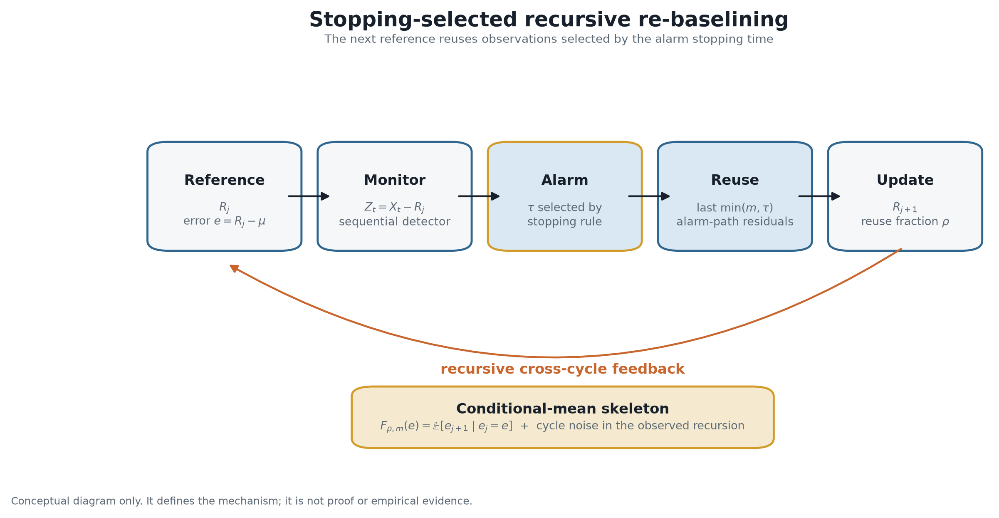
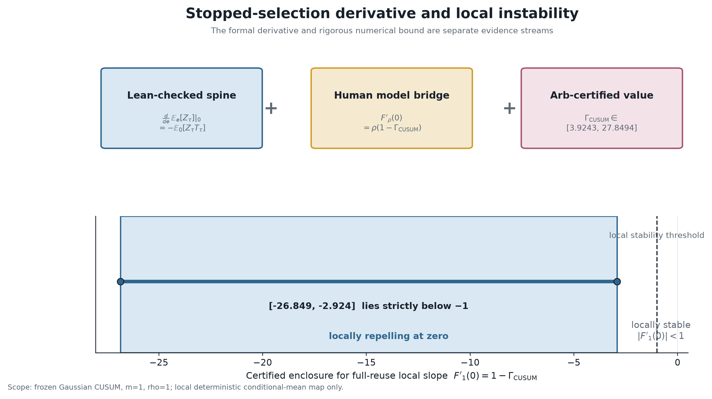
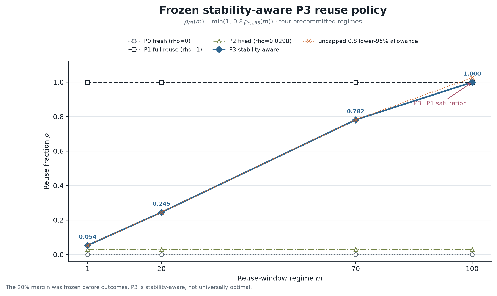
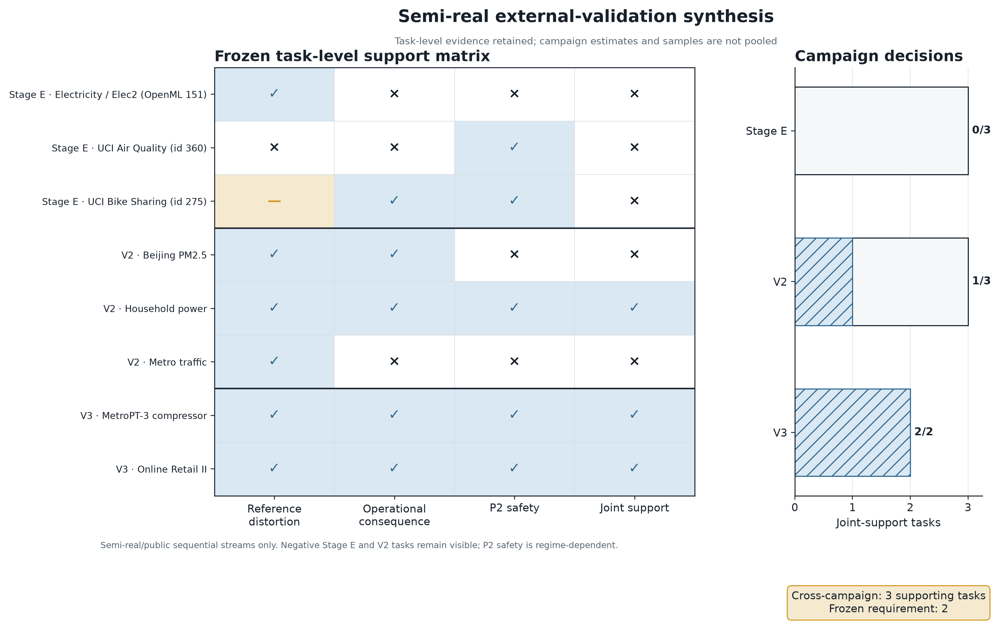
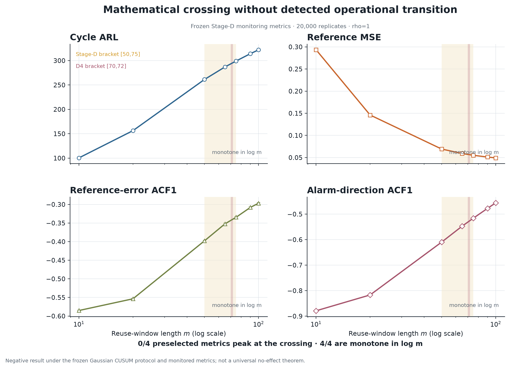

# ReBaseGuard

**Stopping-selected recursive re-baselining in repeated sequential monitoring.**

**Research status: `LEVEL-4-CLOSED` · 16/16 mandatory requirements passed ·
post-Level-4 `SR-GAMMA-CERTIFIED`**

“Level 4” is an internally frozen research-program closure criterion, not an
external academic certification. The terminal ledger contains **17 PASS, 1
PARTIAL, 0 FAIL, and 0 OPEN**; the sole partial item, L4R-13, is nonmandatory.
See the [final closure report](level4/final_level4_closure/FINAL_REPORT.md) and
[mechanical decision](level4/final_level4_closure/results/final_decision.json).

## Why this problem exists

A repeated monitoring system can feed its own stopping decision into its next
cycle:



If observations that participated in an alarm are reused to estimate the next
reference, neither the reused window nor its terminal observation is an
ordinary sample: both were selected by the stopping rule. The updated reference
then changes the distribution and stopping behavior of the next cycle.
ReBaseGuard isolates this feedback mechanism rather than treating it as generic
drift detection.

## Core result

Let \(e\) be the current reference error, \(m\) the reuse-window length,
\(\rho\) the reuse fraction, and \(F_{\rho,m}(e)\) the deterministic
conditional mean of the next reference error. Under the frozen Track-1B
random-window convention,

\[
F'_{\rho,m}(0)=\rho\left(1-\widetilde{\Gamma}_m\right).
\]

For the frozen Gaussian CUSUM with \(m=1\), Lean checks the
stopped-likelihood differentiation spine and outward-rounded Arb arithmetic
independently certifies
\(\Gamma_{\mathrm{CUSUM}}\in[3.9243482,27.8493821]\). The human theorem bridge
therefore makes zero locally linearly repelling at full reuse. This is a local
result for the deterministic conditional-mean map, not a claim of global
instability of the monitoring process.



## Main findings

- The frozen CUSUM stopped-selection derivative identity is supported by a
  human theorem and a Lean-checked differentiation spine.
- Arb certifies \(\Gamma_{\mathrm{CUSUM}}>2\), establishing local repulsion at
  zero for the full-reuse deterministic map.
- A separate rigorous numerical certificate establishes a locally attracting
  period-two orbit of the **deterministic conditional-mean skeleton**; it does
  not establish period-two behavior for the noisy stochastic chain.
- The random-window \(m>1\) theorem includes the exact short-cycle correction
  and yields a protocol-specific \(m\)-\(\rho\) local-stability boundary.
- The symmetric two-chart SR derivative theorem was closed at Level 4. A later
  optional rigor upgrade Arb-certified
  \(\Gamma_{\mathrm{SR}}\in[5.800391799508442,28.781285803081492]\), whose
  lower endpoint exceeds two by \(3.800391799508442\), for the authoritative
  symmetric two-chart SR detector.
- The derivative form extends to regular common-support location families
  under explicit analytic hypotheses; L4R-13 non-Gaussian robustness remains
  nonmandatory partial.
- A frozen stability-aware P3 policy passed its primary scoped criteria, while
  historical failures and unfavorable P2 comparisons remain part of the
  record.
- Semi-real tasks support the scoped package in three tasks against two
  required, while a pre-specified study found no corresponding operational
  transition at the mathematical crossing under the frozen protocol.

The [main theorem architecture](docs/research_synthesis/MAIN_THEOREM_ARCHITECTURE.md)
and [dependency graph](docs/research_synthesis/RESULT_DEPENDENCY_GRAPH.md)
separate these conclusions and their assumptions.

## Evidence map

| Result | Evidence | Authoritative entry point |
|---|---|---|
| CUSUM derivative spine | Human theorem + Lean-checked | [Lean verification](closure/03_LEAN_VERIFICATION.md) |
| \(\Gamma_{\mathrm{CUSUM}}>2\) | Arb-certified | [Arb certificate report](closure/04_ARB_CERTIFICATE.md) |
| Period-two skeleton | Rigorous numerical certificate | [Stage-B report](level4/reports/STAGE_B_PERIOD2_CERTIFICATE_REPORT.md) |
| Random-window \(m>1\) derivative | Human theorem + conditional Lean-checked spine | [Track-1B theorem](level4/closure_proofs/m_gt_1_track1b/THEOREM.md) |
| D4 \(m\)-\(\rho\) boundary | Theorem consequence + confirmatory numerical | [D4 report](level4/closure_proofs/d4_phase_map/FINAL_REPORT.md) |
| SR derivative | Human theorem + conditional Lean-checked spine | [SR report](level4/closure_proofs/sr_derivative/FINAL_REPORT.md) |
| \(\Gamma_{\mathrm{SR}}>2\) | Post-Level-4 Arb-certified | [SR Gamma certificate](level4/closure_proofs/sr_derivative/certificate/GAMMA_CERTIFICATE.md) |
| Location-family derivative | Human theorem + conditional Lean-checked spine | [Location-family theorem](level4/closure_proofs/location_family_track3ab/THEOREM.md) |
| External validation | Semi-real empirical | [Cross-campaign aggregation](level4/closure_proofs/external_validation_v3/CROSS_CAMPAIGN_AGGREGATION.md) |
| Operational crossing | Negative result | [L4R-12 report](level4/closure_proofs/l4r12_operational_crossing/FINAL_REPORT.md) |

Evidence labels are descriptive rather than cumulative. See the
[evidence hierarchy](docs/research_synthesis/EVIDENCE_HIERARCHY.md) for exactly
what each layer does and does not establish.

## Stability-aware reuse policy

The frozen P3 method uses 80% of the simultaneous lower-95% D4 boundary,
clipped at one:

\[
\rho_{\mathrm{P3}}(m)=\min\left(1,\;0.8\,\rho_{c,L95}(m)\right).
\]



At \(m=1,20,70,100\), P3 uses reuse fractions \(0.053642\), \(0.245418\),
\(0.781994\), and \(1\). In active regimes it improved the frozen reference-MSE
and false-alert-burden contrasts against P1. At \(m=100\), P3 saturates at P1;
P2 retains descriptive advantages at \(m=70\) and \(m=100\), and two secondary
\(\epsilon=0.05\) conditions fail. The result is scoped to the frozen policy
protocol.

## External validation

The external-validation package retains every semi-real/public sequential task
without pooling samples: Stage E is **0/3**, V2 is **1/3**, and V3 is **2/2**.
That is three supporting tasks against two required. Unsuccessful tasks remain
visible, and P2 safety is regime-dependent. These results are not production
deployment evidence.



## Negative result

The D4 mathematical local-stability boundary brackets the full-reuse crossing
at \(m\in[70,72]\). Under the frozen Stage-D protocol, **0/4** preselected
operational metrics peaked at the crossing and **4/4** were monotone in
\(\log m\). The study therefore detected no corresponding operational
transition. This conclusion is limited to the frozen Gaussian CUSUM protocol,
grid, shifts, and monitored metrics.



## Reproduce

From a normal Git clone on a Unix-like system with Bash, Python 3, Git, the
repository’s Python environments, Lean/Lake, and FLINT/Arb available as
documented, reproduce the historical terminal Level-4 closure with:

```bash
bash level4/final_level4_closure/reproduce.sh
```

Reproduce the separate post-Level-4 SR rigor upgrade with:

```bash
bash level4/closure_proofs/sr_derivative/certificate/reproduce_closed_upgrade.sh
```

It verifies protected hashes, frozen decisions, the requirement ledger,
adversarial claim checks, and recorded reproduction state without starting new
science. Useful component checks are:

```bash
bash scripts/verify_level_4.sh
python3 docs/research_synthesis/verify_synthesis.py --no-diff-check
level4/.venv/bin/python scripts/generate_final_figures.py
```

Figure hashes and exact evidence paths are recorded in
[figures/final/README.md](figures/final/README.md).

## Repository map

| Topic | Entry point |
|---|---|
| Terminal closure | [level4/final_level4_closure/](level4/final_level4_closure/) |
| Reviewer synthesis | [docs/research_synthesis/](docs/research_synthesis/) |
| Complete evidence routing | [REPOSITORY_MAP.md](docs/research_synthesis/REPOSITORY_MAP.md) |
| Lean formalization | [rebaseguard-lean/](rebaseguard-lean/) |
| Arb CUSUM certificate | [rebaseguard-proof/proofs/certificate.json](rebaseguard-proof/proofs/certificate.json) |
| Random-window \(m>1\) theorem | [m_gt_1_track1b/](level4/closure_proofs/m_gt_1_track1b/) |
| D4 local-stability map | [d4_phase_map/](level4/closure_proofs/d4_phase_map/) |
| SR theorem and evidence boundary | [sr_derivative/](level4/closure_proofs/sr_derivative/) |
| Post-Level-4 SR Gamma certificate | [GAMMA_CERTIFICATE.md](level4/closure_proofs/sr_derivative/certificate/GAMMA_CERTIFICATE.md) |
| SR upgrade release and archive provenance | [SR release notes](docs/releases/SR_GAMMA_CERTIFIED_RELEASE_NOTES.md) |
| Location-family theorem | [location_family_track3ab/](level4/closure_proofs/location_family_track3ab/) |
| P3 policy | [l4r06_policy/](level4/closure_proofs/l4r06_policy/) |
| External validation | [external_validation_v3/](level4/closure_proofs/external_validation_v3/) |
| Novelty audit | [novelty_verification/](level4/closure_proofs/novelty_verification/) |
| Final figures | [figures/final/](figures/final/) |

## Limitations

- L4R-13, the stronger non-Gaussian robustness requirement, remains
  `PARTIAL` and nonmandatory.
- At terminal Level-4 closure, the optional rigorous SR Arb certificate was
  `OPEN`; it was subsequently closed as `SR-GAMMA-CERTIFIED`. This does not
  broaden the result beyond the authoritative symmetric two-chart SR model.
- The D4 boundary is a deterministic local-stability map, not an operational
  phase-transition theorem.
- Empirical policy safety is regime-dependent; the project does not establish a
  universally safe or universally optimal reuse rule.
- Semi-real tasks do not establish production readiness.
- Within the documented N2 search scope, no identified work combines the same
  alarm-stopped next-reference mechanism with the reported derivative and
  stability results. This is a scoped literature-audit position, not a priority
  claim or exhaustive search.

See [limitations and open items](docs/research_synthesis/LIMITATIONS_AND_OPEN_ITEMS.md)
for the full boundary.

## Citation

No paper DOI or release DOI is assigned. For the terminal Level-4 snapshot use
`rebaseguard-level4-closed`; for the additive SR certificate use
`rebaseguard-sr-gamma-certified`. Include the resolved commit, repository URL,
and access date. A `CITATION.cff` is intentionally not supplied because complete
author metadata is not established in repository-authoritative records.

## License

No explicit license is currently included. Copyright defaults therefore apply;
do not assume permission to reuse, modify, or redistribute beyond applicable
law.
