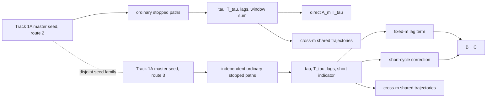

# Track 1A covariance and estimator audit

**Audit date:** 2026-08-22  
**Repository boundary:** `f54171a6b4bb1dab94bcb7eba49759d868e83779`  
**Historical artifacts modified:** no

## 1. Exact Track 1A statistic

For each `m`, Track 1A compared

`X_m = GammaD_direct,m`

against

`Y_m = GammaB_reconstruction,m + C_reconstruction,m`.

It formed `epsilon_m=X_m-Y_m` and used

`SE(epsilon_m)=sqrt(SE(X_m)^2+SE(Y_m)^2)`.

Two independent replications were then inverse-variance pooled. The resulting
absolute z-values were `2.361, 2.546, 2.606, 2.858, 3.130, 2.564` at
`m={1,2,5,10,20,50}`. The frozen `m=20` result remains a failure.

## 2. Route-level dependency graph

Route 2 used keys `[Track1A-master,2,replicate,batch]`; route 3 used
`[Track1A-master,3,replicate,batch]`. The master value remains recorded in the
immutable Track 1A protocol. Each route had two replications, 20 batches
per replication, 50,000 paths per batch, and one million paths per
replication. The two routes shared no seeds, stopped paths, `tau`, `T_tau`,
lags, windows, denominators, or short-cycle indicators.

Within one route, the same stopped paths were evaluated at every `m`; this
created strong cross-`m` correlation. It did not create covariance between the
route-2 and route-3 estimators compared at a fixed `m`.

## 3. Answers to the required covariance questions

### A. Were the compared estimators independent?

Yes. Under the simulation design, `X_m` and `Y_m` were functions of disjoint
PCG64 streams produced from disjoint `SeedSequence` keys. Their Monte Carlo
sampling covariance was zero by design.

### B. Was the variance formula correct?

Yes. The general formula is

`Var(X-Y)=Var(X)+Var(Y)-2Cov(X,Y)`.

For the actual Track 1A comparison, `Cov(X,Y)=0`, so its implemented
`sqrt(SE_X^2+SE_Y^2)` calculation was the correct specialization. Track 1A
did not omit a covariance term that should have been estimated.

### C. What was the covariance sign and magnitude?

For the estimators actually compared, the designed covariance was exactly
zero.

For a hypothetical same-path calculation, direct and reconstructed pathwise
integrands are equal. Their correlation is one and their covariance equals
the direct-integrand variance. Track 1A's retained direct-route moments imply
the following prospective paired magnitudes:

| `m` | path-integrand covariance | covariance of a one-million-path mean |
|---:|---:|---:|
| 1 | 1631.9351 | 0.00163194 |
| 2 | 1123.5254 | 0.00112353 |
| 5 | 626.9241 | 0.00062692 |
| 10 | 272.1469 | 0.00027215 |
| 20 | 89.2704 | 0.00008927 |
| 50 | 22.0059 | 0.00002201 |

These positive covariance terms cancel the two marginal variances in a paired
difference, leaving only floating-point accumulation error.

### D. What would ignoring covariance do?

In a same-path paired design it would be strongly conservative because the
covariance is positive and almost maximal. That statement does not rescue or
reinterpret Track 1A: its compared routes were independent, so its zero-
covariance formula was valid.

## 4. Pathwise identity versus estimator identity

The following are distinct:

1. pathwise identity: `A_m T_tau = B_m T_tau + correction` on every path;
2. equality of expectations after integration;
3. equality of two Monte Carlo point estimates;
4. uncertainty of their difference.

Track 1A verified item 1 to machine roundoff. Items 2 and 3 do not force two
independently sampled means to be numerically equal. Independent sample means
can differ by several nominal SE with small but nonzero probability.

The route-level discrepancies were positive and similar across all `m`
because each route reused its stopped paths across the grid. Thus the six
cellwise z-values were correlated manifestations of a route-level sampling
fluctuation. The `3.130` outcome is not explained by a missing covariance term;
it is consistent with Monte Carlo fluctuation under a correlated grid and
remains a frozen failure.

## 5. Alternative explanations checked

- **Batch mismatch:** both routes used the same sizes and counts, but disjoint
  keys; no batch was reused across routes.
- **Random normalization:** the direct route used `min(m,tau)`; the
  reconstruction retained the fixed denominator plus the exact short-cycle
  correction.
- **Finite-sample bias:** both sample means are ordinary means of path
  integrands; no ratio of random sample means was used.
- **CRN:** none existed between the compared routes.
- **Numerical accumulation:** both routes separately passed the pathwise
  identity; discrepancies were orders of magnitude larger than roundoff.
- **Route-specific conditioning:** both routes simulated the same ordinary
  in-control CUSUM law from reset state.
- **SE implementation:** marginal SEs came from retained sums and sums of
  squares; independence justified their quadrature combination.

## 6. Historical reproduction

The Track 1B audit replayed Track 1 and Track 1A through the Track 1A
reproducer. Track 1 reproduced `MGT1-THEOREM-PARTIAL`; Track 1A reproduced
`MGT1-TRACK1A-FAILED`. Their 46 and 32 isolated tests passed, respectively.
