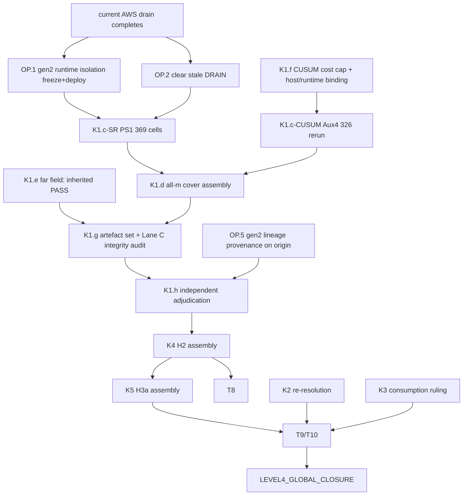

# P5Y post-K1 frontier: dependency DAG (audit, 2026-09-13)

**Scope.** This is a repository audit, not an adjudication. It contains no new scientific
result. `K1 = NOT CLOSED`, `P5Y = NOT CLOSED` and `LEVEL4_GLOBAL_CLOSURE = NO` all stand.
Every obligation below is quoted from a committed record. None is invented. Where a
record is stale, the row says so and cites the live observation behind that.

Sources:
- `p5y_k1_binding_campaign/CHECKPOINT.md` §17, §18, §25, §26 (K1 verdict criteria and required artefacts)
- `p5y_k1_successor_optimized/CHECKPOINT_S.md`
- `p5y_k2k5_forward_audit/FORWARD_AUDIT.md`
- `p5_nonlinear_dynamics/THEOREM.md`
- `p5y_k1_ps1_production_qualification/RESULT.md`
- `p5y_k1_ps1_portable_recovery/{RESULT.md, config/GENERATION_TRANSITION.json}`, taken from the gen2 lineage on AWS
- `p5y_k1_cusum_aux4_fullcover/{RESULTS.md, README.md, evidence/blas_kernel_sensitivity.json}`
- `docs/research_synthesis/PS1_CURRENT_STATUS.md`
- The read-only AWS observation at 2026-09-13T04:26Z, and this session's Lanes A–C

## 1. Live state these records do not yet show (observed read-only, nothing touched)

| fact | evidence |
|---|---|
| Genuine PS1 SR production **is running**, as execution generation 2. `PS1_CURRENT_STATUS.md` ("NOT STARTED, 0 cells") is stale. | unit `rbg-p5y-k1-ps1-recov-aws-20260912T154658Z-2011fded` active; 16 `ps1_cellseq_worker` processes; gen2 ledger in `ReBaseGuard-ps1-prod-gen2` |
| At 04:26Z: 0 finalized cells, 64 open cell reservations (16 groups × 4 cells), governed charged 1,622 CPU-h against the 6,600 cap. The imported generation-1 history is 92.32 CPU-h. | `rbg-runtime/p5y_k1_ps1_generation2/heartbeat.json`, gen2 ledger |
| An operator compatibility DRAIN has been in force since 2026-09-12T16:04:18Z, at the path the live launcher polls. No new cell is admitted; in-flight cells finalize at their boundary. | `rbg-runtime/p5y_k1_ps1_production/work/DRAIN` |
| The gen2 producing lineage (29 commits, `f3cec1ed..082526be`) exists only in AWS worktrees and a local read-only fetch. It is **not** on `origin`. | `git worktree list` on AWS; `refs/remotes/aws/ps1-gen2-ops` |

## 2. K1 closure criteria (CHECKPOINT §25) mapped to state

| node | obligation (quoted source) | state now | class |
|---|---|---|---|
| K1.a | checkpoint integrity PASS | recorded PASS for PS1 (Checkpoint A, temporal integrity) | already discharged (re-verified at adjudication) |
| K1.b | Task-1 F_r PASS | Task1R PASS (immutable) | already discharged |
| K1.c-SR | every SR compact-cover cell PASS: PS1 369 cells × 28 obligations | 0/369 genuine; campaign running and draining; the 369-cell cells-outer basis is 5,694 CPU-h (qualified patch-outer basis 4,413–4,642) | **full compute** (AWS, in progress) |
| K1.c-CUSUM | every CUSUM compact-cover cell PASS; adjudication requires a full 326-cell Aux4 rerun (`CUSUM_COVER_INHERITANCE = REQUIRES_FULL_326_RERUN`) | 2/326 under the Aux4 producer; projection 205.6 CPU-h / 51.4 h wall on 4 physical cores | **full compute**; not blocked by SR |
| K1.d | all four m assembled for BOTH detectors | per-cell T4 already assembles m ∈ {1,2,3,5}; the cover-level assembly runs after both covers | no-compute; blocked by K1 (c-SR, c-CUSUM) |
| K1.e | far-field splice valid for both | inherited PASS for both at `e_far = 12` (P5X-T3; `SR:-1:far_field:all_m`) | already discharged, inherited (adjudicator re-verifies) |
| K1.f | absolute budgets, non-borrowing, CPU cap | PS1 cap 6,600 (SR only). **CUSUM `COST_CAP = NOT_ESTABLISHED`**; historical 1,126/1,848 are immutable history. | governance/publication (CUSUM cap); blocks the K1.c-CUSUM launch |
| K1.g | required artefact set (§26) exists | not produced; Lane C tooling prepares the integrity side | no-compute; blocked by K1 |
| K1.h | INDEPENDENT adjudication (§18) | not started; producer may not self-award | governance/publication; blocked by K1 |

## 3. Operational and host obligations recorded on the K1 execution path

| node | obligation | state | class |
|---|---|---|---|
| OP.1 | gen2 runtime path split (launcher DRAIN/work/evidence vs contract runtime_dir; reconcile scans a directory the launcher never writes). Separation is declared in `GENERATION_TRANSITION.json` but not realised. | `PASS_SYNTHETIC_NOT_DEPLOYED`; **unfrozen**; `LANE_A_DEPLOYMENT_ALLOWED_ONLY_AFTER = CURRENT_LIVE_DRAIN_SETTLED` (`p5y_k1_ps1_gen2_runtime_isolation/DEPLOYMENT_GATE.md`) | lightweight qualification done; freeze and deploy only through the gate, before the next PS1 start |
| OP.2 | stale DRAIN after the current drain: a restart would drain immediately (gen1 compat flag under unrepaired ops; the gen2 flag under repaired ops) | repaired ops refuse the start (`STALE_DRAIN_FLAG`) and archive via `clear-drain` | no-compute (operator step) |
| OP.3 | host maintenance window (`apt-daily-upgrade` tore generation 1) | `host_guard.py` fails closed; the mitigation is operator-applied | governance (operator) |
| OP.4 | Vultr `NOT_QUALIFIED_FOR_PS1` | Lane B: fresh-process determinism PASS; cross-host bit identity vs AWS **FAIL** (the T1 float candidate construction is kernel/host sensitive) | Vultr must not own PS1 cells under the current determinism contract. Multi-host is optional (topology A is valid), so this is not a K1 blocker. |
| OP.5 | gen2 producing lineage on `origin` (provenance for §18 ancestry checks) | published unmodified as `origin/p5y-k1-ps1-gen2-lineage`: `f3cec1ed..082526be`, 29 commits, tip and tree verified | discharged (publication) |
| OP.6 | public status (`PS1_CURRENT_STATUS.md`, README) stale | — | governance/publication; no-compute |

## 4. Downstream of K1 (FORWARD_AUDIT.md; THEOREM.md)

| node | obligation | depends on | class |
|---|---|---|---|
| K2 | `inf_e S(e) > 0`: **not** a hypothesis of T8/T9/T10; the consumed statement must be re-resolved | theorem governance | formal/theorem + governance; **parallelizable now** (no compute) |
| K3 | `M2 < ∞`: already exactly closed by P5-T5/T4; open only whether a non-vacuous M2 is consumed | theorem governance | formal/theorem; **parallelizable now** |
| K4 | (H2) `R(e) < 0` on `(0,2]`, via certified R on `[e_0,2]` plus certified `R' < 0` on `[0,e_0]` | K1 cells (both detectors) | no-compute assembly **if** the K1 cell records carry R and R′. PS1 T4 records carry `R_interval`, `D_interval` (derivative at the midpoint) and `R2_interval`/`M_R2` per m; CUSUM Aux4 reports the same fields. The forward audit's "~620 CPU-h second campaign" finding described the older frozen record. Whether a cellwise R′ enclosure follows from `D_mid ± rho·M_R2` without new compute is **unverified** and must be adjudicated. Blocked by K1. |
| K5 | (H3a) `s = −R/e` strictly decreasing on `(0,2]`; needs cellwise R and R′ | K1, K4 | as K4; blocked by K1 and K4 |
| T8 | conditional on (H1, H2) | K4 | formal/theorem; blocked by K4 |
| T9, T10 | conditional on (H1–H3); T10 also needs `S` continuous at 0 | K1, K4, K5 (+ K2 re-resolution for what T10 consumes) | formal/theorem; blocked |
| G.NOV | `NOVELTY_STATUS = NOT_ESTABLISHED` must not be overclaimed | — | governance/publication; parallelizable now |
| G.L4 | `LEVEL4_GLOBAL_CLOSURE` | everything above | governance; blocked |

§17 is binding: `K1_CLOSED` does not recolour P5 or P5X, and K2–K5 stay open.

## 5. DAG

## 6. Critical path

The drain completes → OP.1 is frozen and deployed and OP.2 is cleared → PS1 runs to
369/369 on AWS. At the recorded ~24.9 cells/24 h that is about 15 days of wall time,
with the 5,694 CPU-h basis against a cap that already carries the charged torn history.
The PS1 cap headroom is the dominant K1 risk: exhaustion forces `K1_INCOMPLETE_BUDGET`.
After that come K1.d → K1.g → K1.h → K4 → K5 → T9/T10.

K1.c-CUSUM (~206 CPU-h) sits on the critical path only as a precondition of K1.d. It is
cheap and can finish long before PS1, once K1.f (its cap and host binding) is decided.

## 7. Best use of each resource

| resource | now | after the current AWS drain/run |
|---|---|---|
| **Claude** (no compute) | K2/K3 theorem re-resolution memos; the K4/K5 assembly derivation (is the cellwise R′ bound recoverable from `D_interval` + `M_R2`?) with result-agnostic code on synthetic records; package the OP.1 freeze; refresh the stale status docs (OP.6); CUSUM cap/binding decision memo (K1.f) | run the Lane C audit read-only; populate the closure skeleton's integrity sections; prepare the §26 artefact set |
| **Vultr** (non-result-bearing unless authorized) | Lane A regression suite; K4/K5 assembly dry runs on synthetic records. **Not** PS1 cells (OP.4 FAIL). | the K1.c-CUSUM full rerun, *if* K1.f binds its runtime contract to this host. The Aux4 producer binds the OpenBLAS kernel, so the 326-cell rerun must be homogeneous on one host/kernel. Vultr has 4 physical cores ≈ 51 h wall. |
| **AWS** | nothing: the live run must not be touched | deploy the frozen OP.1 successor, `clear-drain`, restart PS1 to completion (16 physical cores); then the read-only Lane C audit |
