# P9 theorem dependency graph

**Anchor commit:** `ffe23a63181e2ff11380768d3c73980de80f94fb`
**Nodes:** 65  •  **Edges:** 64  •  **Cycles:** 0  •  **Inflation violations:** 0

## Edge semantics — read this before reading the graph

Edges are **not** "these two priorities discuss the same object". There are exactly three edge types and they behave differently:

| type | meaning | bounds strength? |
|---|---|---|
| `premise` | the parent is a logical premise of the child | **yes** — the child may not be stronger than the weakest premise |
| `verifies` | the parent is an independent evidence *layer about* the child (Lean kernel check, Arb certificate) | **no** — and crucially it does **not** license upgrading the child |
| `diagnoses` | the parent explains or reconciles a recorded negative result | no |

The `verifies` type exists because of a real repository invariant: *"Lean does not certify either numerical interval; Arb does not prove differentiation under the expectation. The human theorem supplies the bridge."* A formal layer is a fact about an artifact, not an upgrade to the science it is about. Collapsing `verifies` into `premise` is exactly how a `CONDITIONAL_THEOREM` gets narrated as machine-verified fact.

## Mermaid (premise edges solid, verifies dotted, diagnoses dashed)

```mermaid
graph TD
  CORE_T1["CORE-T1<br/>EXACT_THEOREM"]
  CORE_C1["CORE-C1<br/>CERTIFIED_NUMERICAL"]
  CORE_C2["CORE-C2<br/>CERTIFIED_NUMERICAL"]
  P1_T1["P1-T1<br/>EXACT_THEOREM"]
  P1_L1["P1-L1<br/>FORMALLY_VERIFIED"]
  P1_N1["P1-N1<br/>EMPIRICAL_REPRODUCED"]
  P2_T1["P2-T1<br/>EXACT_THEOREM"]
  P2_N1["P2-N1<br/>EMPIRICAL_REPRODUCED"]
  P3_T1["P3-T1<br/>EXACT_THEOREM"]
  P3_N1["P3-N1<br/>EMPIRICAL_REPRODUCED"]
  P3_X1["P3-X1<br/>FORMALLY_VERIFIED"]
  P3_N2["P3-N2<br/>EMPIRICAL_ONLY"]
  P3_U1["P3-U1<br/>EMPIRICAL_REPRODUCED"]
  P3_LIM1["P3-LIM1<br/>NOT_ESTABLISHED"]
  P4_T1["P4-T1<br/>CONDITIONAL_THEOREM"]
  P4_T2["P4-T2<br/>CONDITIONAL_THEOREM"]
  P4_L1["P4-L1<br/>FORMALLY_VERIFIED"]
  P4_C1["P4-C1<br/>CERTIFIED_NUMERICAL"]
  P4_F1["P4-F1<br/>NEGATIVE_RESULT"]
  P4_F2["P4-F2<br/>NEGATIVE_RESULT"]
  P4_F3["P4-F3<br/>NEGATIVE_RESULT"]
  P4_R1["P4-R1<br/>EMPIRICAL_REPRODUCED"]
  P4_NOV["P4-NOV<br/>NOT_ESTABLISHED"]
  P5_T1["P5-T1<br/>EXACT_THEOREM"]
  P5_T7["P5-T7<br/>EXACT_THEOREM"]
  P5_T11["P5-T11<br/>EXACT_THEOREM"]
  P5_T8T9["P5-T8T9<br/>CONDITIONAL_THEOREM"]
  P5_T10["P5-T10<br/>CONDITIONAL_THEOREM"]
  P5_MECH["P5-MECH<br/>EXACT_THEOREM"]
  P5_N1["P5-N1<br/>EMPIRICAL_ONLY"]
  P5_N2["P5-N2<br/>EMPIRICAL_ONLY"]
  P5_N3["P5-N3<br/>EMPIRICAL_ONLY"]
  P5_N4["P5-N4<br/>EMPIRICAL_ONLY"]
  P5_F1["P5-F1<br/>NEGATIVE_RESULT"]
  P5_NOV["P5-NOV<br/>NOT_ESTABLISHED"]
  P6_T6A["P6-T6A<br/>EXACT_THEOREM"]
  P6_T6B["P6-T6B<br/>EXACT_THEOREM"]
  P6_T6C["P6-T6C<br/>EXACT_THEOREM"]
  P6_T6D["P6-T6D<br/>CONDITIONAL_THEOREM"]
  P6_T6E["P6-T6E<br/>CONDITIONAL_THEOREM"]
  P6_EMP["P6-EMP<br/>EMPIRICAL_REPRODUCED"]
  P6_F1["P6-F1<br/>PARTIAL_PRIORITY_RESULT"]
  P6_NOV["P6-NOV<br/>NOT_ESTABLISHED"]
  P7_A["P7-A<br/>EXACT_THEOREM"]
  P7_B["P7-B<br/>CONDITIONAL_THEOREM"]
  P7_C["P7-C<br/>CONDITIONAL_THEOREM"]
  P7_D["P7-D<br/>EMPIRICAL_ONLY"]
  P7_E1["P7-E1<br/>EMPIRICAL_REPRODUCED"]
  P7_E2["P7-E2<br/>EMPIRICAL_REPRODUCED"]
  P7_D0["P7-D0<br/>EXACT_THEOREM"]
  P7_R1["P7-R1<br/>NEGATIVE_RESULT"]
  P7_R2["P7-R2<br/>NEGATIVE_RESULT"]
  PROJ_L4R11["PROJ-L4R11<br/>NEGATIVE_RESULT"]
  PROJ_L4R13["PROJ-L4R13<br/>PARTIAL_PRIORITY_RESULT"]
  PROJ_STAGED["PROJ-STAGED<br/>NEGATIVE_RESULT"]
  PROJ_SCOPE["PROJ-SCOPE<br/>NEGATIVE_RESULT"]
  P8_V["P8-V<br/>NEGATIVE_RESULT"]
  P8_S1["P8-S1<br/>EXACT_THEOREM"]
  P8_S2["P8-S2<br/>CONDITIONAL_THEOREM"]
  P8_S3["P8-S3<br/>EMPIRICAL_ONLY"]
  P8_S4["P8-S4<br/>NEGATIVE_RESULT"]
  P8_S5["P8-S5<br/>NOT_ESTABLISHED"]
  P9_T1["P9-T1<br/>EXACT_THEOREM"]
  P9_T2["P9-T2<br/>EXACT_THEOREM"]
  P9_N1["P9-N1<br/>EMPIRICAL_REPRODUCED"]
  CORE_T1 -.-> CORE_C1
  CORE_T1 -.-> CORE_C2
  CORE_T1 --> P1_T1
  P1_T1 -.-> P1_L1
  P1_T1 --> P1_N1
  CORE_T1 --> P2_T1
  P2_T1 --> P2_N1
  P1_T1 --> P3_T1
  P2_T1 --> P3_T1
  P3_T1 --> P3_N1
  P1_N1 --> P3_N1
  P2_N1 --> P3_N1
  P3_T1 --> P3_X1
  P3_N1 --> P3_N2
  P3_N1 --> P3_U1
  P1_T1 --> P4_T1
  P2_T1 --> P4_T1
  P4_T1 --> P4_T2
  P4_T1 -.-> P4_L1
  P4_T1 -.-> P4_C1
  P4_T1 --> P4_F1
  P4_T1 --> P4_F2
  P4_T1 --> P4_F3
  P2_N1 --> P4_F3
  P4_F1 -..-> P4_R1
  P1_T1 --> P5_T1
  P2_T1 --> P5_T1
  P5_T1 --> P5_T7
  P5_T7 --> P5_T11
  P5_T1 --> P5_T8T9
  P3_T1 --> P5_T8T9
  P5_T8T9 --> P5_T10
  P5_T1 --> P5_MECH
  P5_T7 --> P5_MECH
  P5_T8T9 --> P5_N1
  P5_T7 --> P5_N2
  P5_T7 --> P5_N3
  P5_T7 --> P5_N4
  P5_N1 --> P5_F1
  P5_T7 --> P6_T6A
  P6_T6A --> P6_T6B
  P5_T7 --> P6_T6B
  P5_T1 --> P6_T6C
  P6_T6A --> P6_T6D
  P6_T6C --> P6_T6E
  P6_T6C --> P6_EMP
  P6_T6B --> P6_EMP
  P6_EMP --> P6_F1
  P5_T1 --> P7_A
  P7_A --> P7_B
  P7_B --> P7_C
  P3_T1 --> P7_C
  P7_C --> P7_D
  P7_A --> P7_E1
  P7_E1 --> P7_E2
  P7_A --> P7_D0
  P5_T1 --> P7_D0
  P3_T1 --> P7_R1
  P7_E1 --> P7_R1
  P7_R1 --> P7_R2
  P5_T1 --> P9_T2
  P5_T7 --> P9_T2
  P7_A --> P9_T2
  P5_T7 --> P9_N1
```

## Edge table

| from | type | to | parent status | child status |
|---|---|---|---|---|
| `CORE-T1` | verifies | `CORE-C1` | EXACT_THEOREM | CERTIFIED_NUMERICAL |
| `CORE-T1` | verifies | `CORE-C2` | EXACT_THEOREM | CERTIFIED_NUMERICAL |
| `CORE-T1` | premise | `P1-T1` | EXACT_THEOREM | EXACT_THEOREM |
| `P1-T1` | verifies | `P1-L1` | EXACT_THEOREM | FORMALLY_VERIFIED |
| `P1-T1` | premise | `P1-N1` | EXACT_THEOREM | EMPIRICAL_REPRODUCED |
| `CORE-T1` | premise | `P2-T1` | EXACT_THEOREM | EXACT_THEOREM |
| `P2-T1` | premise | `P2-N1` | EXACT_THEOREM | EMPIRICAL_REPRODUCED |
| `P1-T1` | premise | `P3-T1` | EXACT_THEOREM | EXACT_THEOREM |
| `P2-T1` | premise | `P3-T1` | EXACT_THEOREM | EXACT_THEOREM |
| `P3-T1` | premise | `P3-N1` | EXACT_THEOREM | EMPIRICAL_REPRODUCED |
| `P1-N1` | premise | `P3-N1` | EMPIRICAL_REPRODUCED | EMPIRICAL_REPRODUCED |
| `P2-N1` | premise | `P3-N1` | EMPIRICAL_REPRODUCED | EMPIRICAL_REPRODUCED |
| `P3-T1` | premise | `P3-X1` | EXACT_THEOREM | FORMALLY_VERIFIED |
| `P3-N1` | premise | `P3-N2` | EMPIRICAL_REPRODUCED | EMPIRICAL_ONLY |
| `P3-N1` | premise | `P3-U1` | EMPIRICAL_REPRODUCED | EMPIRICAL_REPRODUCED |
| `P1-T1` | premise | `P4-T1` | EXACT_THEOREM | CONDITIONAL_THEOREM |
| `P2-T1` | premise | `P4-T1` | EXACT_THEOREM | CONDITIONAL_THEOREM |
| `P4-T1` | premise | `P4-T2` | CONDITIONAL_THEOREM | CONDITIONAL_THEOREM |
| `P4-T1` | verifies | `P4-L1` | CONDITIONAL_THEOREM | FORMALLY_VERIFIED |
| `P4-T1` | verifies | `P4-C1` | CONDITIONAL_THEOREM | CERTIFIED_NUMERICAL |
| `P4-T1` | premise | `P4-F1` | CONDITIONAL_THEOREM | NEGATIVE_RESULT |
| `P4-T1` | premise | `P4-F2` | CONDITIONAL_THEOREM | NEGATIVE_RESULT |
| `P4-T1` | premise | `P4-F3` | CONDITIONAL_THEOREM | NEGATIVE_RESULT |
| `P2-N1` | premise | `P4-F3` | EMPIRICAL_REPRODUCED | NEGATIVE_RESULT |
| `P4-F1` | diagnoses | `P4-R1` | NEGATIVE_RESULT | EMPIRICAL_REPRODUCED |
| `P1-T1` | premise | `P5-T1` | EXACT_THEOREM | EXACT_THEOREM |
| `P2-T1` | premise | `P5-T1` | EXACT_THEOREM | EXACT_THEOREM |
| `P5-T1` | premise | `P5-T7` | EXACT_THEOREM | EXACT_THEOREM |
| `P5-T7` | premise | `P5-T11` | EXACT_THEOREM | EXACT_THEOREM |
| `P5-T1` | premise | `P5-T8T9` | EXACT_THEOREM | CONDITIONAL_THEOREM |
| `P3-T1` | premise | `P5-T8T9` | EXACT_THEOREM | CONDITIONAL_THEOREM |
| `P5-T8T9` | premise | `P5-T10` | CONDITIONAL_THEOREM | CONDITIONAL_THEOREM |
| `P5-T1` | premise | `P5-MECH` | EXACT_THEOREM | EXACT_THEOREM |
| `P5-T7` | premise | `P5-MECH` | EXACT_THEOREM | EXACT_THEOREM |
| `P5-T8T9` | premise | `P5-N1` | CONDITIONAL_THEOREM | EMPIRICAL_ONLY |
| `P5-T7` | premise | `P5-N2` | EXACT_THEOREM | EMPIRICAL_ONLY |
| `P5-T7` | premise | `P5-N3` | EXACT_THEOREM | EMPIRICAL_ONLY |
| `P5-T7` | premise | `P5-N4` | EXACT_THEOREM | EMPIRICAL_ONLY |
| `P5-N1` | premise | `P5-F1` | EMPIRICAL_ONLY | NEGATIVE_RESULT |
| `P5-T7` | premise | `P6-T6A` | EXACT_THEOREM | EXACT_THEOREM |
| `P6-T6A` | premise | `P6-T6B` | EXACT_THEOREM | EXACT_THEOREM |
| `P5-T7` | premise | `P6-T6B` | EXACT_THEOREM | EXACT_THEOREM |
| `P5-T1` | premise | `P6-T6C` | EXACT_THEOREM | EXACT_THEOREM |
| `P6-T6A` | premise | `P6-T6D` | EXACT_THEOREM | CONDITIONAL_THEOREM |
| `P6-T6C` | premise | `P6-T6E` | EXACT_THEOREM | CONDITIONAL_THEOREM |
| `P6-T6C` | premise | `P6-EMP` | EXACT_THEOREM | EMPIRICAL_REPRODUCED |
| `P6-T6B` | premise | `P6-EMP` | EXACT_THEOREM | EMPIRICAL_REPRODUCED |
| `P6-EMP` | premise | `P6-F1` | EMPIRICAL_REPRODUCED | PARTIAL_PRIORITY_RESULT |
| `P5-T1` | premise | `P7-A` | EXACT_THEOREM | EXACT_THEOREM |
| `P7-A` | premise | `P7-B` | EXACT_THEOREM | CONDITIONAL_THEOREM |
| `P7-B` | premise | `P7-C` | CONDITIONAL_THEOREM | CONDITIONAL_THEOREM |
| `P3-T1` | premise | `P7-C` | EXACT_THEOREM | CONDITIONAL_THEOREM |
| `P7-C` | premise | `P7-D` | CONDITIONAL_THEOREM | EMPIRICAL_ONLY |
| `P7-A` | premise | `P7-E1` | EXACT_THEOREM | EMPIRICAL_REPRODUCED |
| `P7-E1` | premise | `P7-E2` | EMPIRICAL_REPRODUCED | EMPIRICAL_REPRODUCED |
| `P7-A` | premise | `P7-D0` | EXACT_THEOREM | EXACT_THEOREM |
| `P5-T1` | premise | `P7-D0` | EXACT_THEOREM | EXACT_THEOREM |
| `P3-T1` | premise | `P7-R1` | EXACT_THEOREM | NEGATIVE_RESULT |
| `P7-E1` | premise | `P7-R1` | EMPIRICAL_REPRODUCED | NEGATIVE_RESULT |
| `P7-R1` | premise | `P7-R2` | NEGATIVE_RESULT | NEGATIVE_RESULT |
| `P5-T1` | premise | `P9-T2` | EXACT_THEOREM | EXACT_THEOREM |
| `P5-T7` | premise | `P9-T2` | EXACT_THEOREM | EXACT_THEOREM |
| `P7-A` | premise | `P9-T2` | EXACT_THEOREM | EXACT_THEOREM |
| `P5-T7` | premise | `P9-N1` | EXACT_THEOREM | EMPIRICAL_REPRODUCED |

## Roots (no premise above them)

* `CORE-T1` — EXACT_THEOREM
* `CORE-C1` — CERTIFIED_NUMERICAL
* `CORE-C2` — CERTIFIED_NUMERICAL
* `P1-L1` — FORMALLY_VERIFIED
* `P3-LIM1` — NOT_ESTABLISHED
* `P4-L1` — FORMALLY_VERIFIED
* `P4-C1` — CERTIFIED_NUMERICAL
* `P4-R1` — EMPIRICAL_REPRODUCED
* `P4-NOV` — NOT_ESTABLISHED
* `P5-NOV` — NOT_ESTABLISHED
* `P6-NOV` — NOT_ESTABLISHED
* `PROJ-L4R11` — NEGATIVE_RESULT
* `PROJ-L4R13` — PARTIAL_PRIORITY_RESULT
* `PROJ-STAGED` — NEGATIVE_RESULT
* `PROJ-SCOPE` — NEGATIVE_RESULT
* `P8-V` — NEGATIVE_RESULT
* `P8-S1` — EXACT_THEOREM
* `P8-S2` — CONDITIONAL_THEOREM
* `P8-S3` — EMPIRICAL_ONLY
* `P8-S4` — NEGATIVE_RESULT
* `P8-S5` — NOT_ESTABLISHED
* `P9-T1` — EXACT_THEOREM